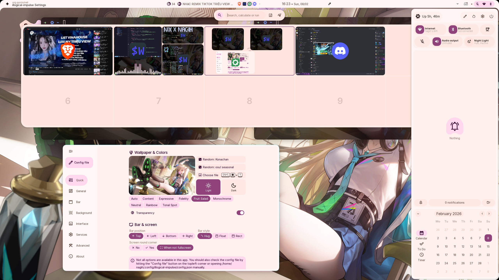
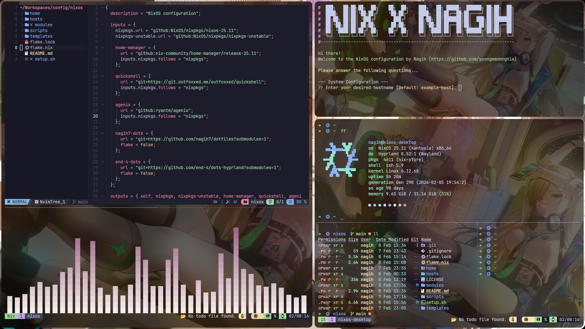

<div align="center">

[](https://nixos.org)
[](https://hyprland.org)
[](https://www.gnu.org/licenses/gpl-3.0)
[](https://github.com/nagih7/nix)

<h2>Nagih's NixOS Configuration</h2>

_A modern, reproducible NixOS configuration powered by Hyprland & Flakes._

</div>

## Overview

This is a comprehensive NixOS configuration built around the Hyprland Wayland compositor, designed for developers and enthusiasts who prioritize a beautiful, functional, and reproducible desktop environment.

Leveraging the robust foundation of [end-4/dots-hyprland](https://github.com/end-4/dots-hyprland) for core Hyprland and Quickshell components, this configuration extends the ecosystem with custom modules, performance optimizations, and a DevOps-centric workflow.

## Installation

### Prerequisites

- **Architecture**: x86_64-linux
- **OS**: NixOS 25.11 or later (Unstable)
- **Firmware**: UEFI system
- **Hardware**: At least 8GB RAM recommended, 20GB+ free disk space.

### Setup

1.  **Clone the repository:**

    ```bash
    # SSH (Recommended)
    git clone git@github.com:nagih7/nix.git

    # HTTPS
    git clone [https://github.com/nagih7/nix.git](https://github.com/nagih7/nix.git)
    ```

2.  **Run setup script:**

    ```bash
    cd nix
    chmod +x setup.sh
    ./setup.sh
    ```
    
    > **Note:** Ensure you have backed up your current configuration before proceeding.

3.  Follow the on-screen instructions to build and switch generations.

## Usage

### Key Bindings

| Keybinding | Action |
| :--- | :--- |
| <kbd>Super</kbd> + <kbd>Space</kbd> | Open Terminal |
| <kbd>Super</kbd> + <kbd>C</kbd> | Open Code Editor |
| <kbd>Super</kbd> + <kbd>B</kbd> | Open Browser |
| <kbd>Super</kbd> + <kbd>E</kbd> | Open File Explorer |
| <kbd>Super</kbd> + <kbd>F</kbd> | Toggle Fullscreen |
| <kbd>Super</kbd> + <kbd>1</kbd>-<kbd>9</kbd> | Switch Workspace |
| <kbd>Super</kbd> + <kbd>Shift</kbd> + <kbd>1</kbd>-<kbd>9</kbd> | Move Window to Workspace |
| <kbd>Super</kbd> + <kbd>Shift</kbd> + <kbd>L</kbd> | Lock Screen |

### Development Tools

Pre-configured environment includes:

- **Languages:** Python (pip, poetry), Node.js (npm, pnpm), Go, C/C++ (gcc, cmake, clang).
- **Editors:** Neovim (LazyVim based), VS Code.
- **CLI Utilities:** ripgrep, fd, bat, eza, fzf, delta, zoxide.
- **Input Method:** fcitx5 (Unikey)

### Screenshots

| end-4/dots-hyprland | terminal |
|:---|:---------------|
|  |  | |

## Credits

Special thanks to the following projects:

* **[end-4/dots-hyprland](https://github.com/end-4/dots-hyprland)**: For the amazing Hyprland and Quickshell implementation that powers the core UI of this setup.
* **NixOS Community**: For
